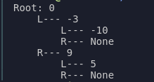
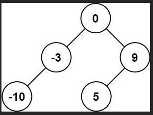

# [108. Convert Sorted Array to Binary Search Tree](https://leetcode.com/problems/convert-sorted-array-to-binary-search-tree/description/?envType=problem-list-v2&envId=p29oug1s)`EASY`

## Notes:
- The `NameError` you are encountering is due to the fact that `Optional` from the `typing` module is not imported. `Optional` is used to indicate that a value can either be of a specified type or `None`.
- The `sortedArrayToBST` method should be called using the instance of the `Solution` class. 
- **Recursive Method Calls:**
   The recursive calls to `self.sortedArrayToBST(leftSubTree)` and `self.sortedArrayToBST(rightSubTree)` correctly build the left and right subtrees.
- **Return Statement:**
   ```python
   return root
   ```
   This returns the root of the constructed binary search tree (BST).


- **Helper Function: ChatGPT**
   ```python
   def printTree(node: Optional[TreeNode], level=0, prefix="Root: "):
   ```
   
   This helper function prints the tree structure in a readable format.

-      <------>  

- The `return root` statement is necessary because it ensures that the constructed binary search tree (BST) is correctly returned from the `sortedArrayToBST` function. Even though you have base conditions to handle empty and single-element arrays, the `return root` statement is required to return the entire subtree rooted at the current node after recursively constructing its left and right subtrees.
   - After constructing the root node and attaching its left and right subtrees, the `return root` statement ensures that the constructed subtree (with the current node as the root) is returned to the caller.
   - This is essential because it allows the parent recursive call to attach this subtree to its respective left or right child pointer.