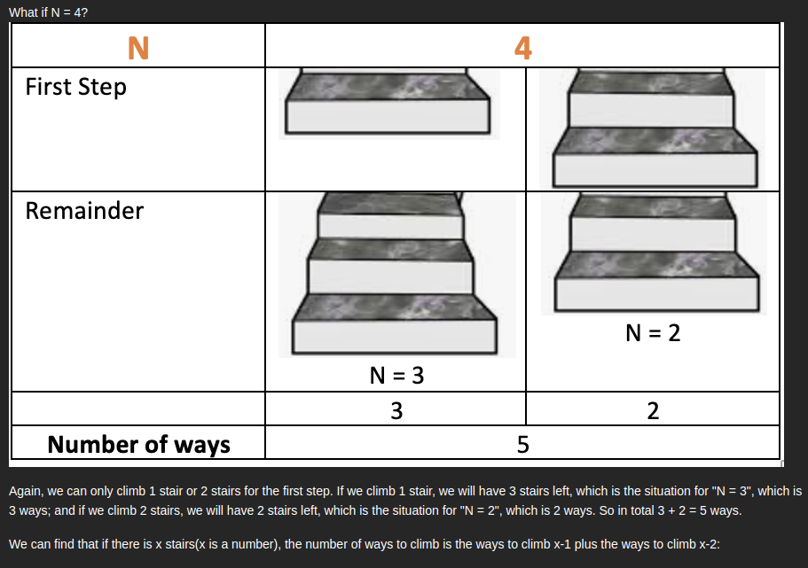

# [70. Climbing Stairs](https://leetcode.com/problems/climbing-stairs/description/) `EASY`

## NOTES:

- Time Limit Exceeded when `n = 44` SO we need `memoization` technique:
```python3
  def __init__(self):
        self.memo = {}
```        